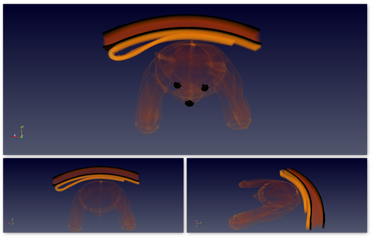
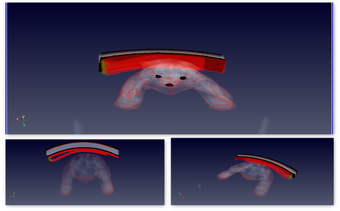
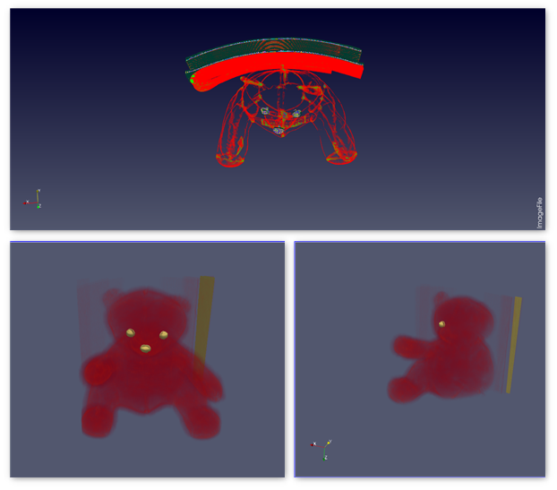

### Visualization 2: Insides of a Teddy Bear
The Teddy Bear dataset is one of the well-known data sets in the visualization world. Various scientific visualizations have been experimented in the past upon this dataset to obtain meaningful results.
This dataset consists of a Teddy Bear resting it's back on a hard-surface. This entire setup is enclosed within a rectangular boundary wrap setup. In the current coursework, a few visualization techniques are applied on this dataset to extract meaningful insights related to the Teddy Bear setup.

{(aim|}
 The Aim of this visualization is to find what the Toy Teddy Bear is made up of and to find few insights about its construction and its design. The structure and the stitching of the teddy bear along with the density of fur filling inside are mainly concentrated to understand the toughness of the teddybear.
 Initially, the rectangular wrapping boundaries are removed/cleaned to obtain the clear view and to identify the given object i.e, in this case a Teddy Bear. In this visualization, the bear is checked for it's ruggedness initially, followed by its insides and then its stitches.
{|aim)}

{(vistype|}
**Figure 1:** The external structure of a teddy bear and its cross-section:

**Figure 2:** The insides of a teddy bear: Fur filling and density:

**Figure 3:** Stitches, scaling and verticle cross-section of a teddy bear:

{|vistype)}
{(vismapping|}
Data Extent:
x-axis: 0 - 511
y-axis: 0 - 511
z-axis: 0 - 62
**Figure 1: External Structure**
Representation: Overlapped - Volume and Contour
Scaling mode: All approximate
Volume Rendering mode: smart
Blend mode: Composite
Color preset: Warm-to-cool
Color Space: Diverging
Clipping: x-axis
Extracted Subset V OI:
x-axis: 50 - 450
y-axis: 50 - 511
z-axis: 0 - 62
**Figure 2: Inner Fur**
Color preset: KAAMS Step
Color Space: Structured
**Figure 3: Structure and Scaling**
Color preset: Warm-to-cool
Color Space: Diverging
Opacity: 1
Discretization Table Value: 256
Transform function values:
Scaling: Z-axis
x-axis: 0
y-axis: 0
z-axis: 10
{|vismapping)}

{(dataprep|}
The inner structure(isosurface) is highlighted using the countour filter. The rectangular wrapping is then removed using extract subset transfer function. The teddybear is then clipped along the X axis to find what's inside it. The scaling of the teddybear is done on Z axis, to have a better view of it's design(Figure 3).
{|dataprep)}

{(limitations|}
This visualisation only considers the birds eye view of what is inside a teddy bear. Although, the fur is seen upon cross-secting the teddy bear, it clearly does not provide any information on the quality or the material of the fur. Only the horizontal clipping of the bear is considered and it does not provide any clear information as to what is hidden inside a teddy bear. Scaling and vertical cross-section provides a proper view of the bear, but that removes the original dimensionality of the bear. The overview of the stitchings is seen in Figure-3 but it fails to show if there are any tears in the stitching. The Visualization can be improved on all these points.
{|limitations)}
