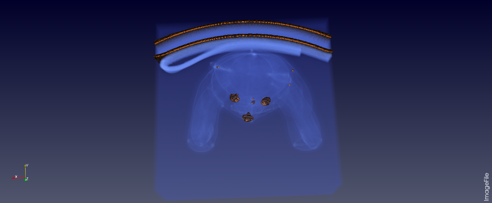
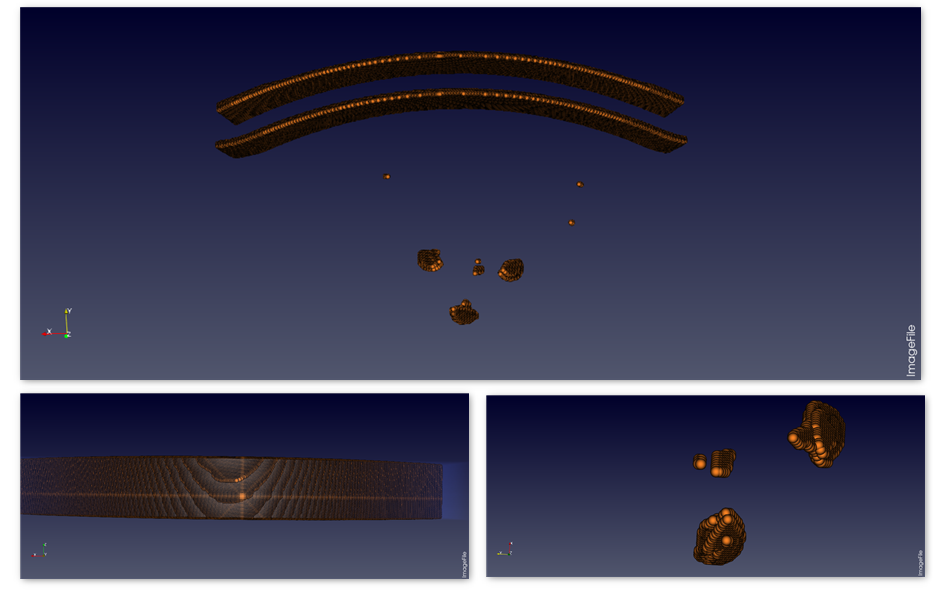
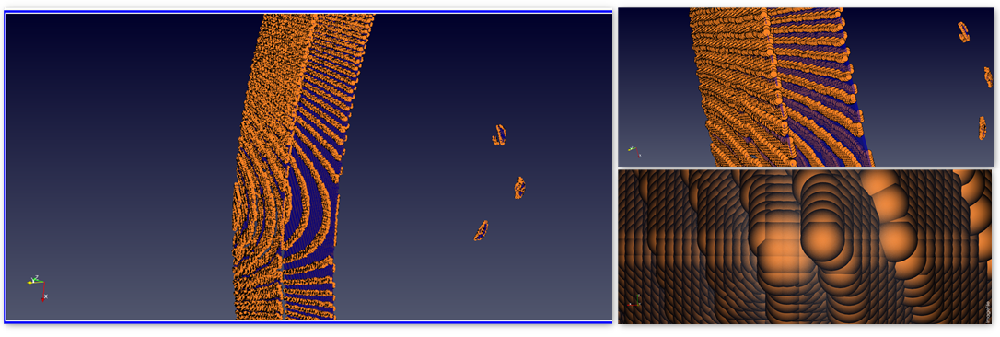

### Visualization 3: Hard Surfaces of the Teddy Bear Dataset

{(aim|}
The Aim of this visualization is to find and analyse the Hard Surfaces in the given dataset. The arrangement of particles, their binding on the surface and finding their position with-in provides the location and the strength of the Hard surfaces.
In the given dataset, the eyes, nose and the back-support on which the bear is rested is found to be made up of hard material. This visualization depicts the structure and binding of the particles of these surfaces.
{|aim)}

{(vistype|}
**Figure 1:** Identifying Hard Surfaces

**Figure 2:** Clear view on the back-support and nose-eye material

**Figure 3:** Closer look providing the structure of back-support(left) and nose-eye material(bottom-right)

{|vistype)}
{(vismapping|}
Data extent:
x-axis: 0 - 511
y-axis: 0 - 511
z-axis: 0 - 62
Representation: Overlapping - Volume + Surface
Color preset: Brewer Diverging Purple-Orange
Color Space: Diverging
Scaling Mode: All approximate
Volume Rendering Mode: Smart
Blend Mode: Composite
Opacity: 1
{|vismapping)}
{(dataprep|}
The Contour filter is initially applied with the shader preset of sphere to properly visualize the Hard Surfaces. Threshold filter is applied over the contour to intensify the visibility of the structure.
{|dataprep)}

{(limitations|}
This visualization only concentrates on visualizing the outer surface of the hard material. This information does not provide any insights into the material or the quality of the surface being analysed. Upon closer look, the visualization shows the dense packing of particles at the surface level, the visualization must be enhanced to provide the structure of the material at Atom level. Also, the density, thick/thin, brittle/strong information is not provided by the visualization which is very important in analysing any surface.
{|limitations)}
