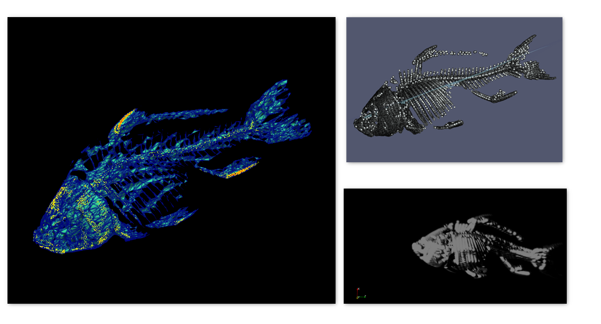
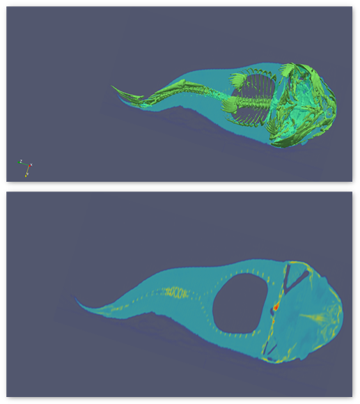

### Visualization 4: The Bone-Flesh Visualization of Fish
The fish dataset is another prominent dataset used in Data Visualization world. This dataset consists of information related to the internal structure and the design of a fish and its components.
Upon initial loading, the opaque fish object is loaded which is enclosed within a rectangular boundary wrap. Various Volume Visualization techniques are encorporated on this dataset to obtain insights about the object: "Fish" in the current coursework.

{(aim|}
The visualization aims to study the structure of Bones of a fish. The design of the skeleton, its weak and strong points are studied. Then, the fish is entirely reconstructed from the bone by filling up flesh and in the end, the cross-sectional views and slices are studied to understand the placement of bone with in the body of the fish. This study is important in understanding the anatomy of a fish.
{|aim)}

{(vistype|}
**Figure 1:** The skeleton system, the bone density(weak sections) and reconstruction:

**Figure 2:** The clipped cross-section and the sliced fish volume:

**Figure 3:** Overview of the fish Skeleton system:

{|vistype)}
{(vismapping|}
Data Extent:
x: 0 - 255
y: 0 - 255
z: 0 - 511
**Figure 1: The Skeleton System**
Representation: point Gaussian
Color preset: spectrum
Color scope: Diverging
Scaling mode: All approximate
Opacity: 1
Shader preset: sphere
**Figure 2: Clipped and Sliced views**
Representation: Overlap - Volume+surface
Color preset: Linear green
Color scope: Linear
**Figure 3: Overview**
Color preset: PuOr
Color scope: Diverging
{|vismapping)}

{(dataprep|}
The Threshold and the Contour filters are applied to obtain the iso-surface(the skeleton) of the fish and to enhance it's visibility. The data is clipped along z axis and overlapped against the volume to obtain the insights of the fish bone-flesh structure and then the data is sliced along z axis obtain an overview of insides of fish
{|dataprep)}

{(limitations|}
The visualization aims to find the structure of bone of a fish and its binding with the flesh. The visualzation depicted above is restricted only to finding the general design of the bone, but doesnot provide any information related to it's internal structure, the strength or any damages and cracks to it. Also, no information regarding the internal organs and the protection provided by bones to the organs is visualized. The structure as a seperate entity is displayed that doesnot completely help in understanding the Fish bone anatomy as a whole. Also,the visualization can be enhanced to display the Bone-tissue interaction, one of the most important interactions to be understood to get an idea about insides of fish.
{|limitations)}
