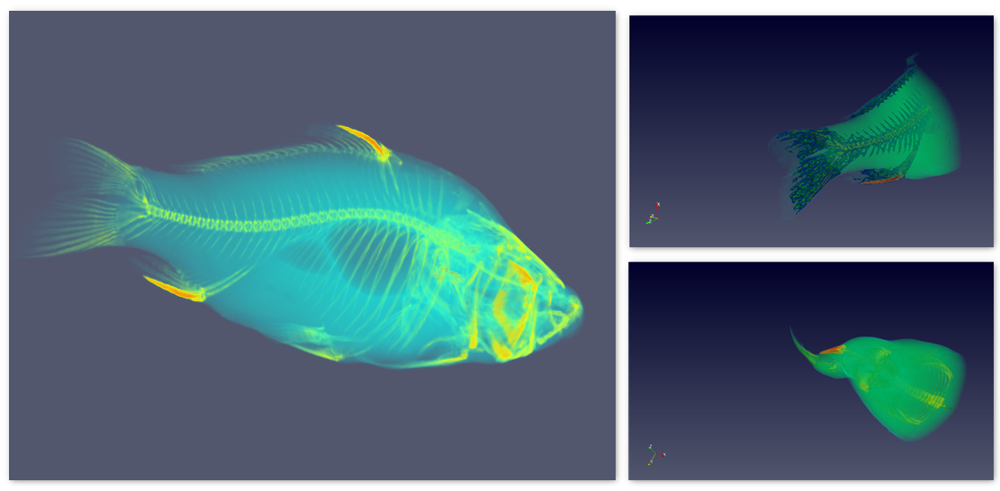
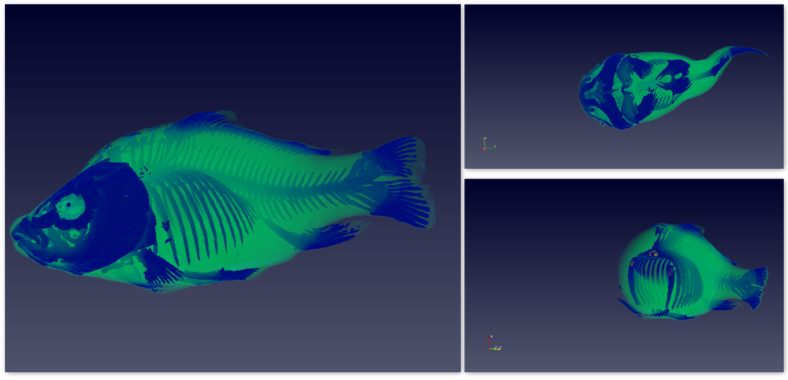
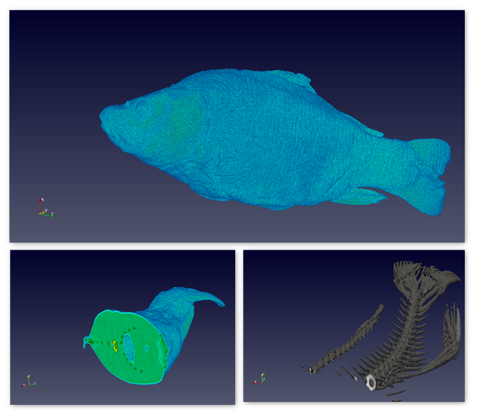

### Visualization 5: The Fish Anatomy

{(aim|}
    The body of a fish is made up of multiple bones and tissues, although the divisions between them are not always externally visible.
    The Aim of the visualization is to show the structure of a fish, its organs or component parts and how they are all put together. The visualization concentrates on the structural details of fish such as skin, interal organs, it's bones and spinal cord.
{|aim)}
{(vistype|}
**Figure 1:** Inner structure of a fish:

**Figure 2:** The insides of a fish - The spine, the bones and the cross sectional clipping:

**Figure 3:** Clipped view of a fish - concentration on the skin and cross-section of Bone:

{|vistype)}
{(vismapping|}
Data Extent:
x-axis: 0 - 255
y-axis: 0 - 255
z-axis: 0 - 511
**Figure 1: Internal Structure**
Representation: Volume
Cell Points: Imagefile
Volume Rendering Mode: Smart
Blend mode: Composite
Scaling mode: All approximate
Ray Tracing: Disabled
Color preset: Blue-Green-Orange
Color space: Diverging
**Figure 2: The cross-sectional Clipping** 
Color preset: Linear Blue
Color space: Linear
**Figure 3: The Bone Cross-section**
Volume Rendering Mode: Smart
Blend Mode: Isosurface
Color preset: X-Ray
Color space: Linear
{|vismapping)}
{(dataprep|}
For the skeleton to be visible - Contour is applied and highlighted. For the cross-sectional structure - the given dataset is clipped along the Z axis - to view the inner flesh of the Fish and aswell to see the bone structure when clipped horizontally.
{|dataprep)}
{(limitations|}
This visualization just takes into account the Lateral line of bones of a fish. The spine, the fins or the Lower Jaw are not specifically considered. It does not consider exploring the scales or the gills which is important in understanding how a fish breathes. The tail and the fins structure helps in understanding the movement of a fish, which is not considered in this visualization. Only the external and high density features are concentrated that does not help in clear understanding the internal anatomy of a fish.
{|limitations)}