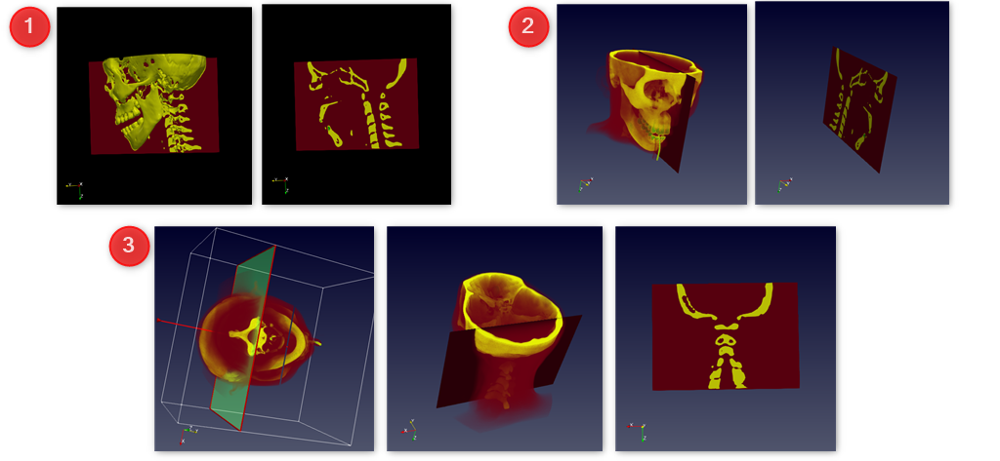

---
elm:
  dependencies:
    gicentre/elm-vegalite: latest

narrative-schemas:
  - volvis
---

## Author: Yogapriya Vankadari 

Various methods are used in Computer Graphics in order to Volume render (2D project) a 3D sampled dataset which is typically scalar. Volume visualization provides various techniques which encompass the mechanisms that make it possible to reveal and explore the inner or unseen structures of volumetric data and provide visual insights into opaque or complex datasets. 
Volume visualization mainly deals with three tasks:
1. Representing 
2. Manipulating
3. Rendering volumetric data.

Given the two mystery datasets and an example dataset, various volume rendering techniques are experimented in order to derive meaningful data from them using Paraview.

ParaView is an open-source  visualization application. Various qualitative and quantitative techniques are encorporated in order to quickly build visualizations to analyse their data. In Paraview, the data exploration is done interactively in 3D.

### Visualization 1 : The Human Head
  An example dataset with the "Head of a human" information from the Paraview is visualized. This dataset is downloaded from the official Paraview Website.
  Filename : headsq.vti

  The "head of a human" datafile consists of Scalar volumetric data. A Human face enclosed within a cylindrical wrap is displayed initially when the dataset is loaded. Also an endotracheal tube is placed through the mouth into the trachea of the human, possibly to help him breathe easier. 

{(aim|}
The main aim of the visualization is to explore the basics of the head - the skull, the tissues, skull-tissue binding and to identify the structures and connections between the bones of the skull and the spinal cord.
The provided visualization identifies the basics of the head starting with extracting the head from the cylinder by thresholding the scalar values. Essential visualization of Human Head Anatomy and the skull-tissue binding along with various cross-sectional sliced views that identify the structure and connections of spinal cord to the Skull - essentially brain are done with the current dataset. The sliced views along with the modelling of human tissue potray the structural complexity of the skull by considering density and spaces present within the structure of the head.
{|aim)}

{(vistype|}
**Figure 1:** Cleaning up stage to extract the inner structure of the face:

**Figure 2:** Contour to obtain skull scalar points - views from different angles:

**Figure 3:** Facial tissue binding to the skull - mainly shows how the flesh covers the skull:

**Figure 4:** Identifying the foreign body "tube" injected into the throat:

**Figure 5:** Cross-sectional sliced views to identify the structures and the connections:

{|vistype)}
{(vismapping|}
**Figure 1: Threshold Filtered Images**
Representation: Volume
Opacity: Enabled
Color preset: Black-body Radiation
Color Space: Default
**Figure 2: Contoured Images**
Representation: Surface
Color preset: X-Ray
Color Space: Linear
Contour by: Scalars
value range: single value: 2047.5
Opacity value: 1
Scaling mode: All Approximate
**Figure 3 & 4: Countoured with intensity Images**
Color preset: Red Temperature
Color Space: Structured
Color Discretize: Number of table values 258
**Figure 5: Sliced Images**
Color preset: Red Temperature
Color Space: Structured
Contour: Enabled for slice
{|vismapping)}

{(dataprep|}
Contouring filter is applied in order to extract the iso-surface of the human head- which is the skeleton consisiting of a skull and the spinal cord. Thresholding is applied in order to remove the cylindrical enclosure for better visibility of the dataset. Appropriate slicing is performed inorder to effectively understand the connection points between the brain and the spinal cord.
{|dataprep)}

{(limitations|}
The current visualization only focuses on the structure of the skull and the flesh surrounding it. It can be further enhanced to explore various other parts that make up the head. This visualization only roots about density and does not provide any specific information about the brain tissues, neurons or parts of brain such as cerebrum and cerebellum. This visualization just provides an overview about the head and does not help in analysis related to the complex anatomy of human head.
{|limitations)}

